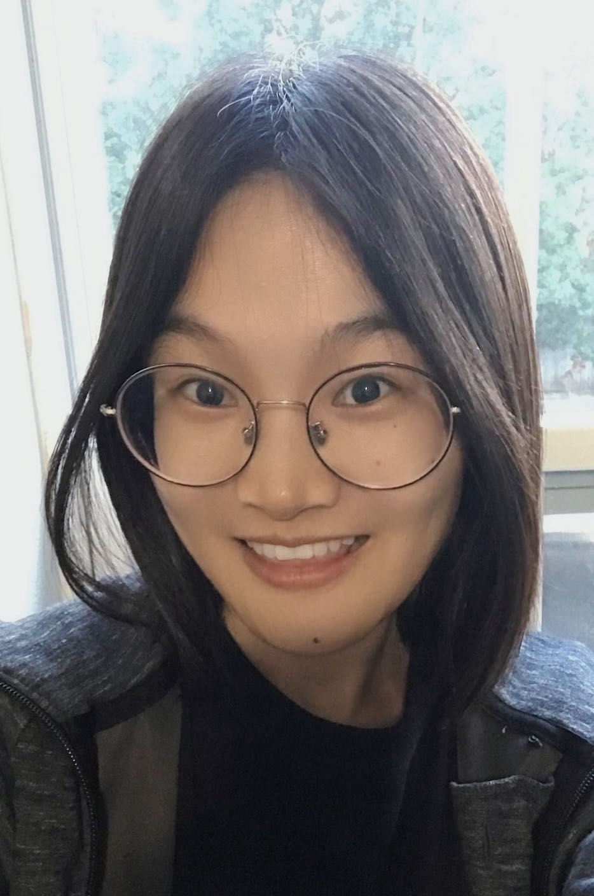

## **About Me**

I am a Ph.D. candidate in economics at the University of Oklahoma (OU). I have been recognized as the first-year outstanding student at OU due to my excellent academic performance. My research has earned recognition through the OU Dodge Family College of Arts and Sciences (DFCAS) Dissertation Completion Fellowship, the DFCAS Dissertation Research Fellowship, and the first-place Chong Liew Summer Research Award. Additionally, I have taught undergraduate courses in microeconomics and statistics at the University of Oklahoma, and I am proficient in various coding languages, including Stata, R, and Python.

## Research Interests

 - Labor and Demographic Economics
 - Economics of Inequality
 - Applied Microeconometrics
 - Machine Learning Application

</a>

